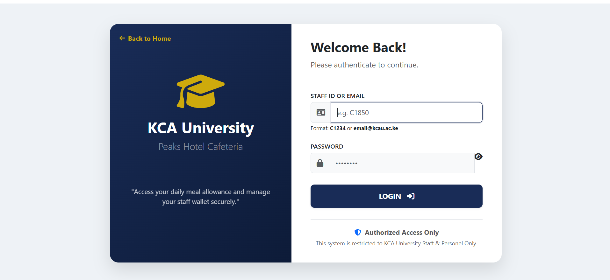
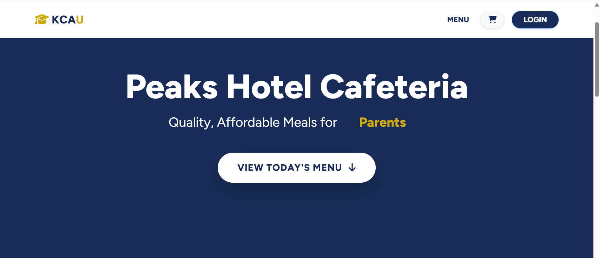
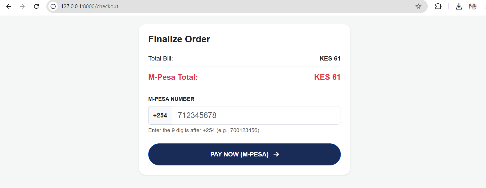
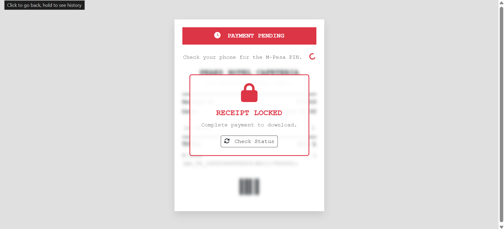
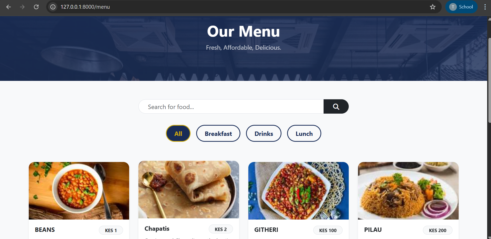
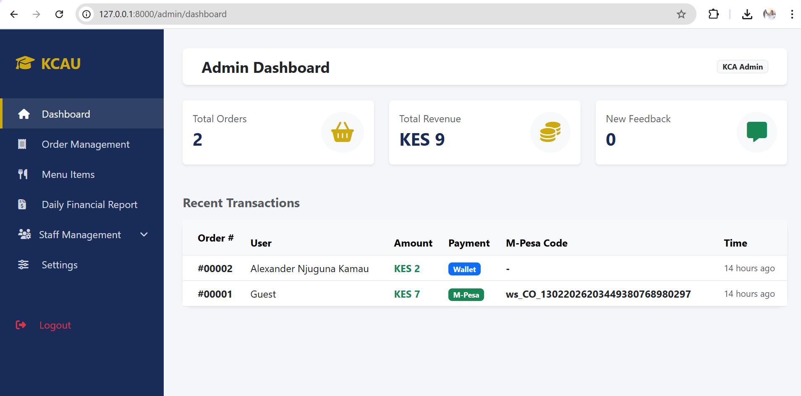

# 🏨 Peaks Hotel Cafeteria System (KCA University)

> A modern, digital cafeteria management system integrating Staff Wallets and M-Pesa Payments.


## 📖 Overview

The **Peaks Hotel Cafeteria System** is a robust web application designed to digitize food ordering at KCA University. It bridges the gap between the university finance department and the cafeteria service provider (Peaks Hotel).

The system allows **Staff** to pay using their daily meal allowances (digital wallet) and **Students/Visitors** to pay instantly via **M-Pesa STK Push**. It features a comprehensive Admin Dashboard for menu management, staff allocation, and financial reporting.

## ✨ Key Features

### 🔐 Security & Access
* **Role-Based Access Control (RBAC):** Distinct portals for Admin, Staff, and Public Users.
* **Secure Authentication:** Encrypted logins with session management.
* **Floating Login Card:** Modern, responsive UI with "Industry Standard" validation.

### 💳 Payment & Wallet System
* **Staff Digital Wallet:** Automatically deducts from daily allowances (e.g., KES 200/day).
* **M-Pesa Daraja API Integration:** Real-time STK Push for payments exceeding the wallet balance.
* **Hybrid Payment Logic:** Intelligently splits bills (e.g., Bill: 250 -> Wallet: 200 + M-Pesa: 50).

### 🧾 Order Processing
* **Digital Receipts:** Receipts are **LOCKED** until payment is verified via Safaricom.
* **Smart Inventory:** Items automatically hide from the menu when stock hits zero.
* **AJAX Cart:** "Add to Cart" actions happen instantly without page reloads.

### 📊 Admin & Finance
* **Daily Finance Reports:** Generates printable reports for KCA Finance reimbursement.
* **Staff Management:** easy CRUD operations for staff members and allowances.
* **Menu Management:** Real-time updates for food items, prices, and stock.

## 🛠️ Tech Stack

* **Framework:** [Laravel 10+](https://laravel.com)
* **Language:** PHP 8.2+
* **Database:** MySQL / PostgreSQL (NeonDB ready)
* **Frontend:** Blade Templates, Bootstrap 5, Custom CSS
* **Payment Gateway:** Safaricom Daraja API (M-Pesa)
* **Tools:** Git, Composer, Ngrok (for local tunneling)

## 📸 Screenshots

| **Staff Login** | **Home Page** |
|:---:|:---:|
|  |  |

| **M-Pesa Integration** | **Locked Receipt** |
|:---:|:---:|
|  |  |

| **Main Menu** | **Admin Dashboard** |
|:---:|:---:|
|  |  |

*(Note: Add screenshots to a `screenshots` folder in your repo to make these visible)*

## 🚀 Installation & Setup

1.  **Clone the Repository**
    ```bash
    git clone [https://github.com/FeiswalDindi/peaks-hotel-cafeteria.git](https://github.com/FeiswalDindi/peaks-hotel-cafeteria.git)
    cd peaks-hotel-cafeteria
    ```

2.  **Install Dependencies**
    ```bash
    composer install
    npm install
    ```

3.  **Environment Setup**
    ```bash
    cp .env.example .env
    php artisan key:generate
    ```

4.  **Database Configuration**
    Update your `.env` file with your database credentials:
    ```ini
    DB_CONNECTION=mysql
    DB_HOST=127.0.0.1
    DB_PORT=3306
    DB_DATABASE=kca_cafeteria
    DB_USERNAME=root
    DB_PASSWORD=
    ```

5.  **M-Pesa Configuration (.env)**
    ```ini
    MPESA_ENV=sandbox
    MPESA_CONSUMER_KEY=your_key
    MPESA_CONSUMER_SECRET=your_secret
    MPESA_BUSINESS_SHORTCODE=174379
    MPESA_PASSKEY=bfb279f9aa9bdbcf158e97dd71a467cd2e0c893059b10f78e6b72ada1ed2c919
    ```

6.  **Run Migrations & Seeders**
    ```bash
    php artisan migrate --seed
    ```

7.  **Serve the Application**
    ```bash
    php artisan serve
    ```

## 🧪 Testing M-Pesa (Localhost)

To test the M-Pesa callback on your local machine, use **Ngrok**:

1.  Run `ngrok http 8000`
2.  Update `MPESA_CALLBACK_URL` in `.env` with your Ngrok link:
    `https://your-ngrok-url.app/api/mpesa/callback`

## 👨‍💻 Credits

**Developer:** Feiswal Dindi
**Institution:** KCA University (Applied Computing Project)
**Client:** Peaks Hotel Cafeteria

---
*Built with ❤️ and Caffeine.*